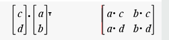
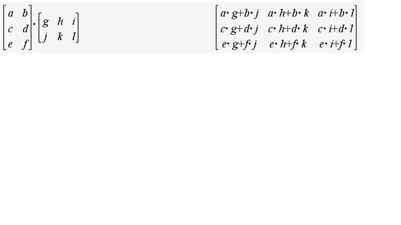

# Linear Algebra Glossary

## Vector
Essentially an array of numbers.  It can be a row vector or a column vector.  It can be used to represent a point in space, a direction, or a line.

Vector addition and subtraction are done element-wise.

### Examples
* 2 dimensional : [2, 3]
* 3 dimensional : [3, 5, 7]

### Row Vector
A vector that is oriented horizontally.  It is a 1xN matrix.

### Column Vector
A vector that is oriented vertically.  It is an Nx1 matrix.

## Dot-product
An operation between two equally-sized vectors that results in a scalar.  It is used to determine the angle between two vectors, or to project one vector onto another.

## Dot-product (aka Inner Product) - Algebraic Definition
The dot product of two vectors is the sum of the products of the corresponding elements of the two vectors.

Alternately, transpose the second vector, then do standard matrix multiplication.

* Associative: No.  You cannot change the order of the vectors.  (A dot B) dot C ≠ A dot (B dot C).
* Distributive: Yes, you can distribute the scalar. a dot (b+c) == a dot b + a dot c
* Commutative: Yes, the dot product is commutative.  A dot B == B dot A

## Dot-Product - Geometric Definition
A * B * cos(θ) where θ is the angle between the two vectors.

* 0 when the vectors are orthogonal
* more-positive when the vectors are similar
* more negative when the vectors are dissimilar

## Hadamard Multiplication
Elementwise Multiplication (eg [a, b] x [c d] = [ a*c b*d ])

Expressed in python as __dot star__ :  V __.*__ W

## Outer Product
The outer product of two vectors is a matrix.  It is the product of the first vector and the transpose of the second vector.

Calculated similarly to dot product except the second vector is transposed instead of the first.

## Cross product
A vector that is perpendicular to the plane defined by the two vectors.    

* Defined only for 2 3D vectors.  
* Result is another 3D vector.

!(../images/CrossProduct.png "Cross Product")

## Matrix 
Essentially a 2D array of numbers.  It can be used to represent a transformation, a set of points, or a set of vectors.

* 3x3 Example : 
	[1, 3, 5], 
	[2, 4, 6], 
	[7, 8, 9]

## Transpose
Swap the rows and columns of a matrix or vector.  This is done by flipping the matrix over its diagonal.

## Matrix Multiplication Example

## Matrix Rank
