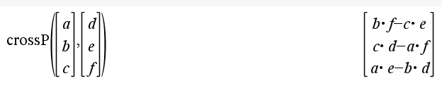

# Linear Algebra Notes

## Vector
Essentially an array of numbers.  It can be a row vector or a column vector.  It can be used to represent a point in space, a direction, or a line.

Vector addition and subtraction are done element-wise.

### Examples
* 2 dimensional : [2, 3]
* 3 dimensional : [3, 5, 7]

### Row Vector
A vector that is oriented horizontally.  It is a 1xN matrix.

### Column Vector
A vector that is oriented vertically.  It is an Nx1 matrix.

## Dot-product
An operation between two equally-sized vectors that results in a scalar.  It is used to determine the angle between two vectors, or to project one vector onto another.


## Dot-product (aka Inner Product) - Algebraic Definition
The dot product of two vectors is the sum of the products of the corresponding elements of the two vectors.

Alternately, transpose the second vector, then do standard matrix multiplication.

* Associative: No.  You cannot change the order of the vectors.  (A dot B) dot C ≠ A dot (B dot C).
* Distributive: Yes, you can distribute the scalar. a dot (b+c) == a dot b + a dot c
* Commutative: Yes, the dot product is commutative.  A dot B == B dot A

## Dot-Product - Geometric Definition
A * B * cos(θ) where θ is the angle between the two vectors.

* 0 when the vectors are orthogonal
* more-positive when the vectors are similar
* more negative when the vectors are dissimilar

## Hadamard Multiplication
Elementwise Multiplication (eg [a, b] x [c d] = [ a*c b*d ])

Expressed in python as __dot star__ :  V __.*__ W

## Outer Product
The outer product of two vectors is a matrix.  It is the product of the first vector and the transpose of the second vector.


Calculated similarly to dot product except the second vector is transposed instead of the first.

## Cross product
A vector that is perpendicular to the plane defined by the two vectors.    

* Defined only for 2 3D vectors.  
* Result is another 3D vector.




## Unit Vector
A vector whose magnitude is 1.  It is used to represent a direction.

## Vector Norm
The length of a vector.  It is calculated by taking the square root of the sum of the squares of the elements of the vector.
(ie.. use pythagoras theorem)

## Dimension
The number of elements in a vector.   


## Field
A set (typically numbers) that can be added, subtracted, multiplied, and divided.  Eg...  Real numbers, complex numbers, rational numbers.  But not Integers though because integer division often does not result in an integer.

## Subspace
A set of all vectors that can be created by taking linear combinations of a set of vectors.

Eg 1:   given v = [2,3], v is in the same subspace as 2v = [4,6] and 3v = [6,9].
Eg 2:	given v = [2,3], w = [0 ,4] combined together form a subspace of [12,2] because 6v = [12,18] and 4w = [0,16] and 6v + 4w = [12,2]

## Actual definition
A subset of a vector space that is closed under addition and scalar multiplication.  It must contain the zero vector.

## Ambient space
The vector space that contains the subspace.

ie... the container for a subspace that may have more dimensions than the subspace it contains.

## Subset
A set of points that satisfy a given condition.
* doesn't need to be closed.
* Doesn't need to include the origin.
* can have boundaries.

## Span
The span of a set of vectors is all possible linear combinations of all vectors in that set.

A matrix is "in the span" of another subspace if it can be created by making linear weighted combinations of all vectors in that subspace.

## Linear Independence (a property of a set)
* A set of vectors is linearly independent if no vector in the set can be created by a linear combination of the other vectors in the set.
* A set of M vectors is independent if each vector points in a geometric dimension not reachable using other vectors in the set.


### Examples  
* A = [0, 2, 5], B = [-27, 5, -37], and C = [3, 4, 9] are linearly independent.
* A = [0, 2, 5], B = [-27, 5, -37], and D =[3, 1, 8] are not linearly independent because 7A - 9C = B.

## Basis
A Basis set is a linearly independent set of vectors that span a vector space.


## Matrix 
Essentially a 2D array of numbers.  It can be used to represent a transformation, a set of points, or a set of vectors.

* 3x3 Example 
```  
[1, 3, 5] 
[2, 4, 6] 
[7, 8, 9]
```  

## Transpose
Swap the rows and columns of a matrix or vector.  This is done by flipping the matrix over its diagonal.

## Hermitian Transpose (aka Conjugate Transpose)
It is the transpose of the matrix with the complex conjugate of each element.

Flip the sign of the imaginary part of a complex number.

Eg...  
* a+bi becomes a - bi
* a-bi becomes a + bi

## Matrix Multiplication Example


## LIVE EVIL rule
(LIVE)^T^ == E^T^V^T^I^T^L^T^

In other words, to apply a transpose to a product of matrices, you can instead reverse the order of the matrices and transpose each one.

This does not work in scenarios where all matrices cannot be transposed.


## Special kinds of matrices

### Square Matrix
A matrix where the number of rows equals the number of columns.

### Symmetric Matrix
A square matrix that is equal to its transpose.

eg...  
```  
[ 1, 2, 3 ]  
[ 2, 4, 5 ]  
[ 3, 5, 6 ]  
```

### Skew-Symmetric Matrix
A square matrix that is equal to the negative of its transpose.
eg...
```  
[ 0, 2, -5 ]  
[ -2, 0, 7 ]  
[ 5, -7, 0 ]  
```

### Pure Rotation Matrix (transformation)
A matrix that rotates a vector but does not scale or skew it.

```
[ cos(θ), -sin(θ) ]
[ sin(θ), cos(θ) ]
```


### Diagonal Matrix
A matrix where all elements are zero except for the diagonal elements.
eg...  
```  
[ 1, 0, 0 ]  
[ 0, 2, 0 ]  
[ 0, 0, 3 ]  
```

### Triangular Matrix
#### upper triangular matrix
A matrix where all elements below the diagonal are zero.
eg...
```  
[ 1, 2, 3 ]  
[ 0, 4, 5 ]  
[ 0, 0, 6 ]  
```

#### lower triangular matrix
A matrix where all elements above the diagonal are zero.
eg...  
```  
[ 1, 0, 0 ]  
[ 2, 4, 0 ]  
[ 3, 5, 6 ]  
```

### Identity Matrix
A square matrix where all elements are zero except for the diagonal elements which are 1.

eg for a 3x3 matrix...  
```  
[ 1, 0, 0 ]  
[ 0, 1, 0 ]  
[ 0, 0, 1 ]  
```

### Block Matrix
A matrix that is made up of smaller matrices.

eg...  
```
[ A, B ]
[ C, D ]
```

where A, B, C, and D are all smaller (2x2) square matrices.

### Multiplicative Identity Matrix
A matrix that when multiplied by another matrix, results in the original matrix.
eg...  for 3x3 matrix...
```  
[ 1, 0, 0 ]  
[ 0, 1, 0 ]  
[ 0, 0, 1 ]  
```

### Additive Identity Matrix (aka Zero Matrix)
A matrix that when added to another matrix, results in the original matrix.  

eg...  for 3x3 matrix...
```  
[ 0, 0, 0 ]  
[ 0, 0, 0 ]  
[ 0, 0, 0 ]  
```

### Additive symmetric matrix
A matrix can be added to its transpose to get a symmetric matrix.

eg...  
```  
[ a, b, c ]    [ a, d, g ]      [a+a, b+d, c+g]
[ d, e, f ] +  [ b, e, h ] =    [b+d, e+e, h+f]
[ g, h, i ]    [ c, f, i ]      [c+g, h+f, i+i]
```
optionally then devide by 2 to scale it back to its previous size.


### Multiplicative symmetric matrix
A matrix that when multiplied by its transpose, results in a symmetric matrix.

eg...  
```  
[ a, b, c ]    [ a, d, g ]      [a*a+b*b+c*c, a*d+b*e+c*f, a*g+b*h+c*i]
[ d, e, f ] *  [ b, e, h ] =    [a*d+b*e+c*f, d*d+e*e+f*f, d*g+e*h+f*i]
[ g, h, i ]    [ c, f, i ]      [a*g+b*h+c*i, d*g+e*h+f*i, g*g+h*h+i*i]
```

## Trace
* The trace of a square matrix is the sum of the diagonal elements.  
* It is used to calculate the determinant of a matrix.
* Trace is only defined for square matrices.

## Broadcasting vs Concatenation


### Matrix Broadcasting
* The process of making two matrices the same size by duplicating rows or columns.
* Used in machine learning to make two matrices the same size so they can be added or multiplied.
* Not common in traditional linear algebra.

eg... to make broadcast a 4x1 matrix to a 4x4 matrix
```
[ 1 ]   becomes   [ 1 1 1 1 ]
[ 2 ]             [ 2 2 2 2 ]
[ 3 ]             [ 3 3 3 3 ]
[ 4 ]             [ 4 4 4 4 ]
```

### Concatenation of matrices
* Concatenation of matrices is the process of joining two matrices together.

eg...
```
[ A, B ] and [ C, D ] can be concatenated to form a 1x4 matrix.
[ A, B, C, D ]
```
 


## Matrix Rank

## Fundamental Eigenvalue equation
A * v = λ * v

Where A is a matrix, v is an eigenvector, and λ is an eigenvalue.

## Eigen Vector
A vector that is not changed by a transformation.  It is a vector that is only scaled by a transformation.

eg...  
```  
[ 2, 1 ]   [ 1 ]   [ 4 ]  
[ 2, 3 ] * [ 2 ] = [ 8 ]  

[1] is the eigen vector of the matrix [2 1]  
[2]                                   [2 3]  
```


## Eigen Value
The scalar that represents how much an eigenvector is scaled by a transformation.

eg in the previous example...  
```
    [ 1 ]   [ 4 ]
4 * [ 2 ] = [ 8 ]

4 is the eigen value of the matrix [2 1]
                                   [2 3]               
                                   
which as the same effect of having multiplied it by [1]
                                                    [2]
```

## Frobenuis dot product
### First way to compute Frobenius dot product

* step 1: multiply the two matrices element-wise
* step 2: sum all the elements in the resulting matrix

### Second Way to compute Frobenius dot product

* Step 1:  Flatten both matrices into vectors.
* Step 2:  Compute the dot product of the two vectors.

### Third way to compute Frobenius dot product
given that a and B are two vectors
Take the trace of (A^T^ B)


## Vectorize a matrix.
To convert a matrix into a vector, you can flatten the matrix.
eg...
```
[ 1, 2, 3 ]   becomes   [ 1 ]
[ 4, 5, 6 ]             [ 4 ]
                        [ 2 ]
                        [ 5 ]
                        [ 3 ]
                        [ 6 ]
```

## Matrix Normalization Techniques

### Frobenuis norm aka Eculedian Norm aka L2 norm aka P2 norm
The square root of the sum of the squares of the elements in a matrix.
eg...with this matrix...
```  
[ 2, 3 ]  
[ 5, 7 ]  
```
the square root of 2^2^ + 3^2^ + 5^2^ + 7^2^ = 9.5

## P norm
The P norm of a matrix is the sum of the absolute values of the elements in the matrix raised to the power of P, then take the Pth root of the result.


### L1 norm, aka P1 norm
Sum of the absolute values of the elements in a matrix.
eg...
```  
[ 2, 3 ]  
[ 5, 7 ]  
```
the sum of the absolute values of the elements = 17

### L-infinity norm
The maximum absolute value of the elements in a matrix.
eg...
```  
[ 2, 3 ]  
[ 5, 7 ]  
```
the maximum absolute value of the elements = 7

### L0 norm
The number of non-zero elements in a matrix.
eg...
```  
[ 2, 3 ]  
[ 5, 7 ]  
```
the number of non-zero elements = 4

### Schatten P Norm
The sum of the Pth power of the singular values of a matrix, then take the Pth root of the result.

## Matrix Asymmetry Index
a~i~ = norm(Ã) / norm(A)

where à is the assymetry matrix (A - A^T^) / 2

## Matrix Inverse
A matrix that when multiplied by another matrix, results in the identity matrix.

### How to calculate the inverse of a matrix (MCA Algorithm)


## Left Inverse
Given the original matrix A
* (A^T^A)^-1^ * A^T^A = Identity matrix I
* (A^T^A)^-1^ * A^T^ => Left Inverse of A

## Right Inverse
Given the original matrix A
* (A\*A^T^)(A\*A^T^)^-1^ = Identity matrix I
* A^T^(A\*A^T^)^-1^ => Right Inverse of A

## Pseudo Inverse


