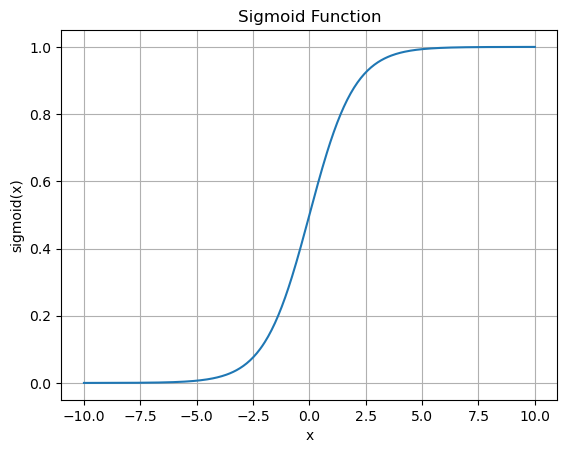

# Statistics

## Summation Notation
given the integers 
$$ a = \{1,3,4,1,6\} 
$$ \
adding them together could be expressed as... 
$$ a_1 + a_2 + a_3 + a_4 + a_5  = 15 
$$ \
or 
$$
\sum^n_{i=1}n_i = 15
$$
or more simply
$$
\sum n = 15
$$

## Logarithms
$$
log(2) = 0.3010 \\
log_{5}(2) = 0.4307 \\
ln(2) = 0.6931 \\
log_{e}(2) = 0.6931 \\
log(e^x) = e^{log(x)} = x
$$

## Sigmoid Function
$$
f(x) = \frac{1}{1+e^{-\beta x}} 
$$
The graph produced by the sigmoid function is an S-shaped curve that can take any real-valued number and map it into a value between 0 and 1.

## Logistic function
given p is the probability of success, between 0 and 1 the logistic function is defined as...
$$
ln(\frac{p}{1-p}) = \beta  $$
solving for p:
$$
p = \frac{1}{1+e^{-\beta x}}
$$
which is the sigmoid function if f(x) is substituted for p if x is 1.

## Rank
The rank of a number in a list is the position of the number in the list when the numbers are sorted in ascending order. If two numbers are the same, the rank is the average of the positions of the two numbers. For example, in the list {4, 2, 1, 3, 5}, the rank of 4 is 4, the rank of 2 is 2, the rank of 1 is 1, the rank of 3 is 3, and the rank of 5 is 5.

## Tied-Rank
A tied rank is a rank that is shared by two or more numbers in a list. For example, in the list {4, 2, 1, 3, 3, 5}, the rank of 3 is 4.5 because it is the average of the positions of the two 3s in the list.

## Rank Transform
Rank transform is a method of transforming data into a rank order. This is useful for data that is not normally distributed.

Given...
$$
s = \{4.01, 1, -10, 4, 394899999999 \} \\

s_{r} = \{4, 2, 1, 3, 5\}
$$

visually....

| 4.01| 1| -10| 4| 394899999999|
|---|---|---|---|---|
| 4| 2| 1| 3| 5|

The rank transform is therefore
* Non-Linear
* Lossy
* Non-Invertable

## Statistics Data Types

| Category | Type | Description | Example |
|---|---|---|---|
|Numerical| Interval | Numeric scale with meaningful intervals | Temp in Celcius | 
|Numerical| Ratio | Numeric scale with a true zero point | Temp in Kevlin |
|Numerical| Discrete | Integers | Population |
|Categorical| Ordinal | Sortable, discrete | Education (eg... High School, Associats, Bachelors, Masters, PHD ) |
|Categorical| Nominal | non-sortable, discrete | genre, gender, color, etc..

## Sample Data vs Population Data
* Population Data: Data that includes all possible values of a variable.
* Sample Data: Data that includes only a subset of the population data.

Common **Population** parameter symbols: $ \mu, \beta, \sigma^2 $ (they have no hats) \
Common **Sample** parameter symbols: $ \hat{\mu}, \hat{\beta}, \hat{\sigma}^2, \bar{\mu} $  (they have hats or bars)

## Data Visualizations
###  Bar Plots
* Useful for representing nominal or ordinal data.
* Numerical data must be converted to discrete data before plotting.
* Can also have error bars, usually standard deviation or standard error.
![[Bar Plot 1]](../images/bar1.png)
![[Bar Plot 2]](../images/bar2.png)

### Box and whisker Plots
* Useful for representing the distribution of data.
* Shows the median, quartiles, and outliers.
* Can be used to compare multiple datasets. \
![[Box Plot]](../images/boxplot.png)

### Histograms
* Useful for representing the distribution of data.
* Shows the frequency of data within a range.
* Can be used to compare multiple datasets.
* Involves binning the data.

![[Histogram]](../images/histogram.png)

### Difference between Histograms and Bar Plots
* Histograms are used to represent the distribution of data.
* Bar plots are used to represent the frequency of data.
* Bar plots have categories on the X axis, while histograms have continuous data on the X axis.

### Pie charts
* Useful for representing the Nominal, Ordinal, and Descrete data.

### Line plots

### Violin plots
Basically a historgram pivoted on it's side and then mirrored across the vertical access to look like a violin.  Can use a different distribution on the left than the right when showing the distribution of two different datasets in the same violin.

## Descriptive vs Inferential Statistics
* Descriptive Statistics: Descriptive statistics are used to **summarize and describe** the main features of a dataset. They include measures of central tendency, measures of dispersion, and measures of shape.
* Inferential Statistics: Inferential statistics are used to make **inferences and predictions** about a population based on a sample of data. They include hypothesis testing, confidence intervals, and regression analysis.

## Accuracy, Precision, and Resolution
* Accuracy: Accuracy is the closeness of a measured value to a standard or known value. It is a measure of how close the measured value is to the true value. Imagine a scatterplot with points on it. Accuracy would be how close the points are to the true value.

* Precision: Precision is the closeness of two or more measurements to each other. It is a measure of how close the measured values are to each other.  Imagine a scatterplot with points on it. Precision would be how close the points are to each other.

* Resolution: Resolution is the smallest change in a quantity that can be detected by a measuring instrument. It is a measure of the smallest change that can be detected by the instrument.  Imagine a scatterplot with a large number of points.  High resolution would indicate more points.

## Dispersion
Dispersion is a measure of how spread out the values in a dataset are. It is a measure of the variability of the data. Common measures of dispersion include the range, variance, and standard deviation.

### Variance
The variance is the average of the squared differences between each data point and the mean of the dataset. It is a measure of how spread out the values in a dataset are.

When using the sample variance, the formula is
$$ \sigma^2 = \frac{1}{n-1} \sum_{i=1}^{n}(x_i - \mu)^2 $$

When using the population variance, the formula is
$$ \sigma^2 = \frac{1}{n} \sum_{i=1}^{n}(x_i - \mu)^2 $$

where:
* $ \sigma^2 $ is the variance,
* $ x_i $ is the ith data point,
* $ \mu $ is the mean of the dataset,
* $ n $ is the number of data points.

### Standard Deviation
The standard deviation is the square root of the variance. It is a measure of how spread out the values in a dataset are.  

$$ \sigma = \sqrt{\sigma^2} $$

where:  
* $ \sigma $ is the standard deviation

## Fano Factor
The Fano factor is a measure of the variability of a dataset.  Sensible only for positive-valued datasets.

$$
F = \frac{\sigma^2}{\mu}
$$

Where:
* $ F $ is the Fano factor,
* $ \sigma^2 $ is the variance,
* $ \mu $ is the mean of the dataset.

### Overdispersed
A Fano factor greater than 1 indicates that the dataset is overdispersed.

### Underdispersed
A Fano factor less than 1 indicates that the dataset is underdispersed.

## Coefficient of variation
The coefficient of variation is a measure of the relative variability of a dataset. It is often expressed as a percentage. Sensible only for positive-valued datasets.

$$
CV = \frac{\sigma}{\mu} \times 100
$$

where: 
* $ CV $ is the coefficient of variation,
* $ \sigma $ is the standard deviation,
* $ \mu $ is the mean of the dataset.

## Quartiles
Quartiles are values that divide a dataset into four equal parts. The first quartile (Q1) is the value below which 25% of the data falls. The second quartile (Q2) is the median of the dataset. The third quartile (Q3) is the value below which 75% of the data falls.  There are 3 quartiles, not 4 because they identify the 3 medians, not the range between the medians.

* 1st quartile - Falls on the left median at the 25% mark
* 2nd quartile - Falls on the global median at the 50% mark
* 3rd quartile - Falls on the right median at the 75% mark

### Interquartile Range
The interquartile range (IQR) is the difference between the third quartile (Q3) and the first quartile (Q1) of a dataset. It is a measure of the spread of the middle 50% of the data.

## QQ Plots (Quantile-Quantile Plots)
A QQ plot is a graphical method for comparing two probability distributions by plotting their quantiles against each other. It is used to determine if two datasets come from the same distribution.

## Moments
Moments are a set of statistics that describe the shape of a probability distribution. The first four moments are the mean, variance, skewness, and kurtosis.

### Mean (Average)
$$
 m_1 = \frac{1}{n} \sum_{i=1}^{n} x_i 
$$
### Variance (Dispersion)
The variance is a measure of the spread of the data.
$$ 
m_2 = \frac{1}{n} \sum_{i=1}^{n} (x_i - \mu)^2
$$
### Skewness (Dispersion asymmetry)
Skewness is a measure of the asymmetry of the data.
* **Positive Skew** is when the tail is on the right side of the distribution.  Also called a right-skewed distribution.
* **Negative Skew** is when the tail is on the left side of the distribution.  Also called a left-skewed distribution.
$$ 
m_3 = \frac{1}{(n\sigma^3)} \sum_{i=1}^{n} ( x_i - \mu )^3
$$
### Kurtosis (Fatness)
Kurtosis is a measure of the "tailedness" of the data.
* **High Kurtosis** indicates a high peak and heavy tails.
* **Low Kurtosis** indicates a flat peak and light tails.
$$ 
m_4 = \frac{1}{(n\sigma^4)} \sum_{i=1}^{n} ( x_i - \mu )^4
$$

## Histogram Bins
$$
k = \left \lceil \frac{max(x) - min(x)}{h}\right \rceil
$$

| Guideline | Formula | Key advantage |
|---|---|---|
| Sturges' Rule | $ k = 1 + log_2(n) $ | Simple and widely used, Depends on data count. |
| Freedman-Diaconis Rule | $ h = 2 \times IQR \times n^{-1/3} $ | Depends on data count and interquartile range . |
| Scott's Rule | $ h = 3.5 \times \sigma \times n^{-1/3} $ | Depends on data count and standard deviation. |
| Arbitrary | $ k=40 $ | Simple |

where:
* $ k $ is the number of bins,
* $ n $ is the number of data points,
* $ IQR $ is the interquartile range,
* $ \sigma $ is the standard deviation.
* $ max(x) $ is the maximum value in the dataset,
* $ min(x) $ is the minimum value in the dataset,
* $ h $ is the bin width

## Shannon Entropy
Shannon entropy is a measure of the uncertainty in a dataset. It is a measure of the average amount of information produced by a random variable. It is used in information theory to quantify the amount of information in a dataset.

* **High entropy** means that the dataset has a lot of variability and is hard to predict.
* **Low entropy** means that many of the values in the dataset repeat.

$$
H = -\sum_{i=1}^{n} p(x_i) \log_2 p(x_i)
$$

where:

* $ H $ is the Shannon entropy,
* $ X $ is the random variable,
* $ x_i $ represents the possible outcomes of ( X ),
* $ p(x_i) $ is the probability of outcome ( x_i ),
* $ n $ is the number of possible outcomes.

The above equation expresses entropy in the unit of bit.  If you replace $ log_2 $ with $ ln $, the entropy is expressed in the unit of nats (named after natural logarithm).

### Difference between variance and entropy
* Variance is a measure of the spread of the data.  It depends on the validity of the main.
* Entropy is a measure of the uncertainty in the data.  It is Nonlinear.

## Z-Score
The Z-score is a measure of how many standard deviations a data point is from the mean of the dataset. It is used to standardize data and compare data points from different datasets.

$$
z = \frac{x - \mu}{\sigma}
$$

where:
* $ z $ is the Z-score,
* $ x $ is the data point,
* $ \mu $ is the mean of the dataset,
* $ \sigma $ is the standard deviation of the dataset.

## Denominator Degrees of Freedom
The denominator degrees of freedom is the number of independent observations in a sample. It is used to calculate the standard error of the mean.